# Tarea Laboratorio 5 Programación Avanzada

### Carlos Andrés Cuéllar Velásquez 2497117
       
## a) Bitácora

1. Problema 1.

   1.1.1 Se crea un nodo para la lista enlazada simple.
       
   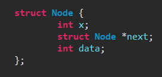
   
   1.1.2 Se crea un constructor que iguala la cabeza a NULL
   
   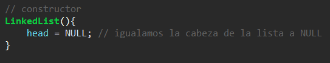
   
   1.1.3 Se agrega la funcion para agregar Valor.
   
   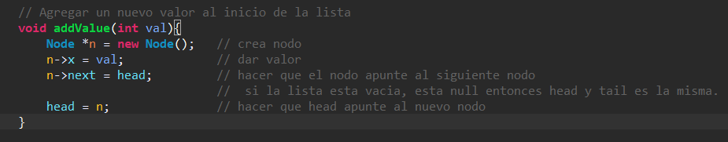
   
   1.1.4 Funcion para retirar elemento y elimar nodo.
   
   
   
   
   1.2.1 Se crea un nodo para la lista doblemente enlazada.
   
   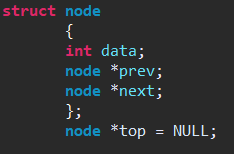
   
   1.2.2 Se crea funcion para buscar en la lista.
   
   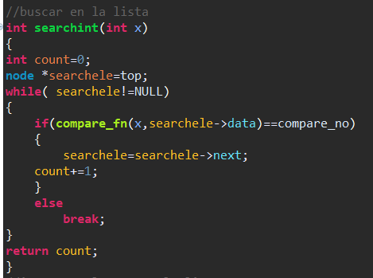
   
   1.2.3 Funcion para insertar en la lista.
   
   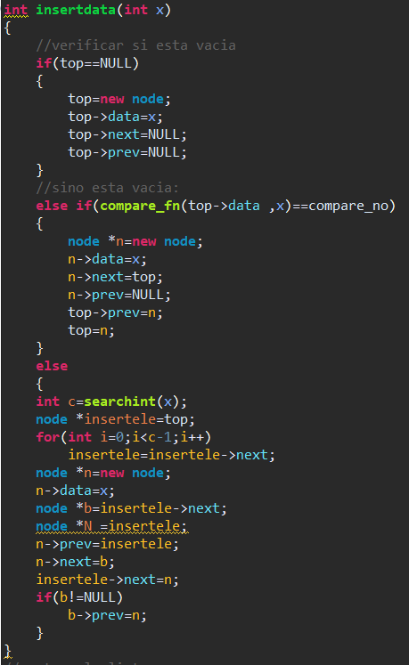
   
   1.2.4 Funcion Mostrar en la lista. 
   
   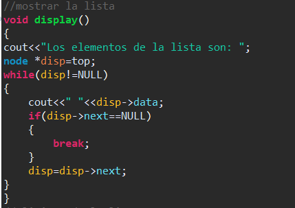
   
   1.2.5 Funcion para eliminar en la lista.
   
   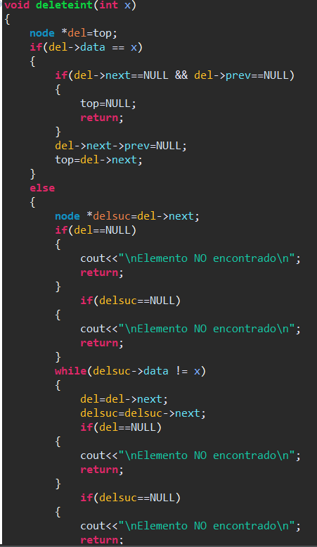
   
   1.2.6 Funcion para invertir la lista.
   
   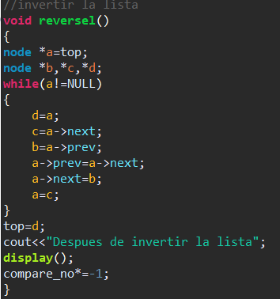
   
   
   1.3.1 Se crea un nodo para la lista enlazada circular.
   
   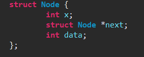
   
   1.3.2 Se agrega la funcion para agregar a la lista. 
   
   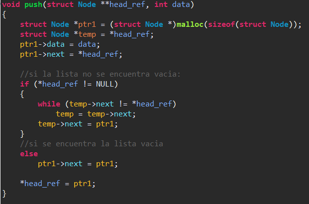
   
   1.3.2 Se agrega la funcion para mostar la lista. 
   
   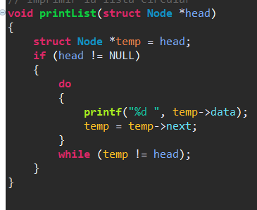
   

 
2. Insertar Valor.

   2.1 Se declara el objeto nuevo nodo y dos variables auxiliares nodo. 
   
   2.2 Mediante un ciclo while se pone el valor con menos valor en la cabeza de la lista y que elemento va abajo dependiendo de su valor.
   
   2.3 Mediante una sentencia If/Else se colocan el resto de los elementos en orden. 
   

3. Mostrar los elementos de la lista.

   3.1 Se inicializa el objeto Nodo "Actual" y se iguala a lista
   
   3.2 Mediante un ciclo while el nodo Actual recorrera la lista hasta que si valor sea NULL que nos dara la pauta que la lista acabo.

4. Mostrar los elementos de la lista.

   4.1 Se inicializa el objeto Nodo "Actual" y se iguala a lista
   
   4.2 Mediante un ciclo while el nodo Actual recorrera la lista hasta que si valor sea NULL que nos dara la pauta que la lista acabo.

5. Mostrar los elementos de la lista.

   5.1 Se inicializa el objeto Nodo "Actual" y se iguala a lista
   
   5.2 Mediante un ciclo while el nodo Actual recorrera la lista hasta que si valor sea NULL que nos dara la pauta que la lista acabo.

6. Main.

      6.1 Se crea el main, dentro se solicita al usuario ingresar 3 datos y se llama a la funcion insertarLista donde los ordenara y          almacenara. 
   
      6.2  Se llama a la funcion mostrarLista donde se imprimira la lista en forma ascendente.
   

