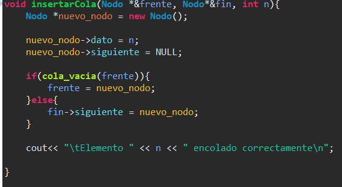
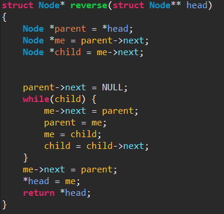
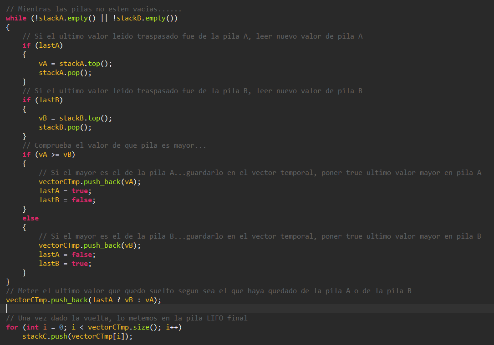
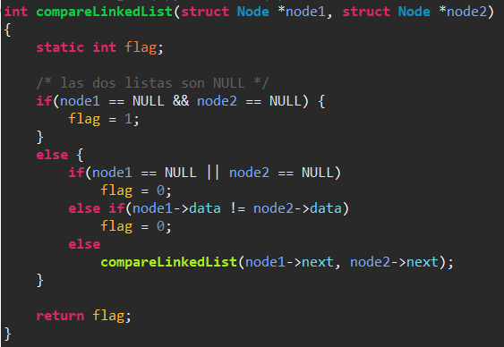
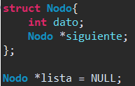
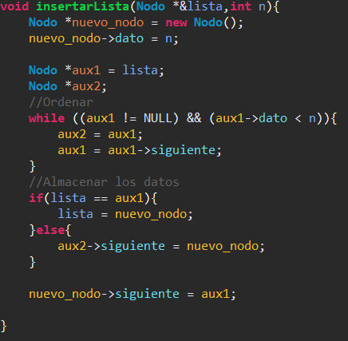
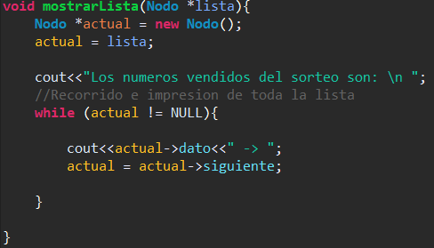
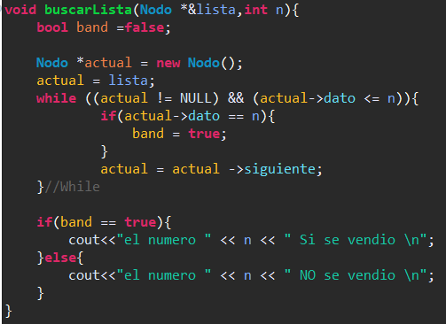
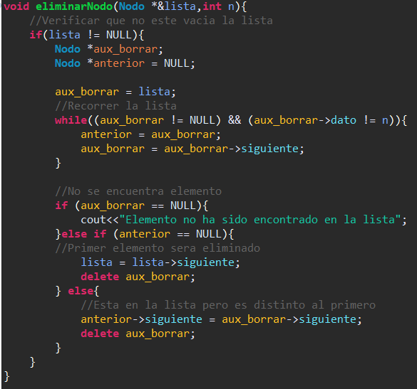
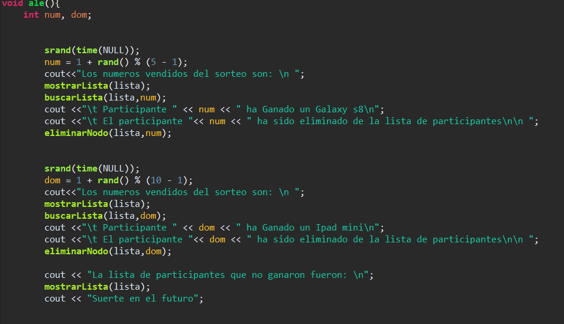

# Tarea Laboratorio 5 Programación Avanzada

### Carlos Andrés Cuéllar Velásquez 2497117
       
## a) Bitácora

1.1 Problema 1 (Lista enlazada simple, doblemente enlazada y enlazada circular)

   1.1.1 Se crea un nodo para la lista enlazada simple.
       
   
   
   1.1.2 Se crea un constructor que iguala la cabeza a NULL
   
   
   
   1.1.3 Se agrega la funcion para agregar Valor.
   
   
   
   1.1.4 Funcion para retirar elemento y elimar nodo.
   
   
   
   
   1.2.1 Se crea un nodo para la lista doblemente enlazada.
   
   
   
   1.2.2 Se crea funcion para buscar en la lista.
   
   
   
   1.2.3 Funcion para insertar en la lista.
   
   
   
   1.2.4 Funcion Mostrar en la lista. 
   
   
   
   1.2.5 Funcion para eliminar en la lista.
   
   
   
   1.2.6 Funcion para invertir la lista.
   
   
   
   
   1.3.1 Se crea un nodo para la lista enlazada circular.
   
   
   
   1.3.2 Se agrega la funcion para agregar a la lista. 
   
   
   
   1.3.2 Se agrega la funcion para mostar la lista. 
   
   
   
1.2 Problema 1 (Cola, Pila y Lista DINAMICAS)

   1.4.1 Se crea un nodo para la Pila.
       
   
   
   1.4.2 Se crea funcion para apilar.
   
   
   
   1.4.3 Se agrega la funcion para mostrar.
   
   
   
   1.4.4 Se agrega la funcion para desapilar.
   
   
   
   
   1.5.1 Se crea un nodo para la Cola.
       
   
   
   1.5.2 Se crea funcion para ver si esta vacia.
   
   
   
   1.5.3 Se crea funcion para encolar.
   
   
   
   1.5.4 Se agrega la funcion para desencolar.
   
   
   
   
   1.6.1 Se crea un nodo para la Lista.
       
   
   
   1.6.2 Se crea funcion para ver insertar a la lista.
   
   
   
   1.6.3 Se crea funcion para mostrar lista.
   
   
   
   1.6.4 Se agrega la funcion para buscar en la lista.
   
   
   
   1.6.5 Se agrega la funcion para eliminar algun nodo.
   
   
   
1.3 Problema 1 (Cola, Pila y Lista ARRAY)

   1.7.1 Se crea funcion para ver si la cola esta vacia o esta llena.
       
   
   
   1.7.2 Se crea funcion para desencolar.
   
   
   
   1.7.3 Se agrega la funcion para encolar.
   
   
   
   1.7.4 Se agrega la funcion para imprimir.
   
   
   
   
   1.8.1 Se inicializa el tamaño y funcion para liberar espacio.
       
   
   
   1.8.2 Se crea funcion para insertar a la lista.
   
   
   
   1.8.3 Se crea funcion para imprrimir.
   
   
   
 
   1.9.1 Funcion para apilar.
       
   
   
   1.9.2 Funcion para desapilar.
   
   
   
   1.9.3 Se crea funcion para mostar lista.
   
   
   
   1.9.4 Se agrega la funcion para ver si esta vacia.
   
   
   

2. Problema 2.

   2.1 Funcion para invertir el orden, siendo el primer elemento el ultimo en la lista. 
   
   
   

3. Problema 3.

   3.1 Codigo que verificar que no esten vacias las listas, obtienen los valores de las listas, ordena los valores y los inserta en una nueva lista.
   
   
   
  

4. Problema 4.

   4.1 Funcion que hace la comparacion de las listas.
   
   
   

5. Problema 5.

   5.1 Se crea el Nodo para la lista.
   
   
   
   5.2 Funcion para insertar participantes.

   
   
   5.3 Funcion para mostrar el listado de participantes.
   
   
   
   5.4 Funcion para buscar el participante ganador del premio.
   
   
   
   5.5 Funcion para eliminar al participante que ya ha ganado un premio.
   
   
   
   5.6 Funcion donde se genera el numero al azar del premio para otorgar al ganador. 
   
   
  

